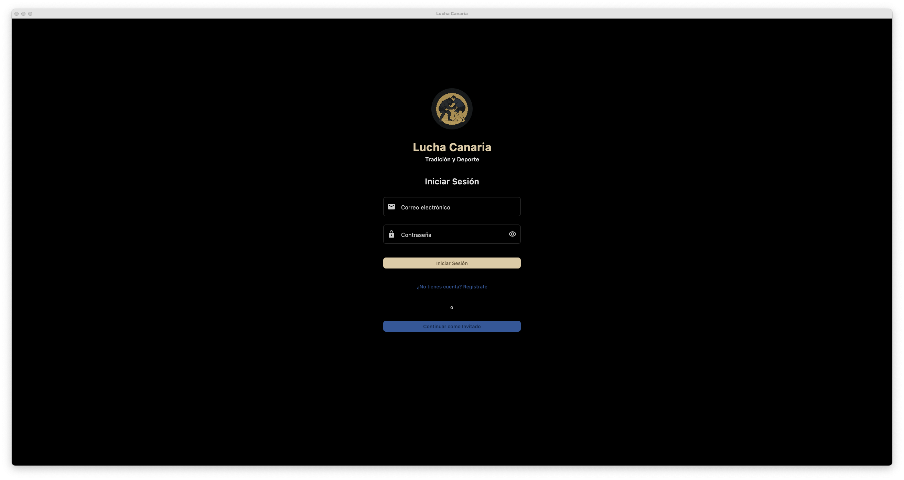
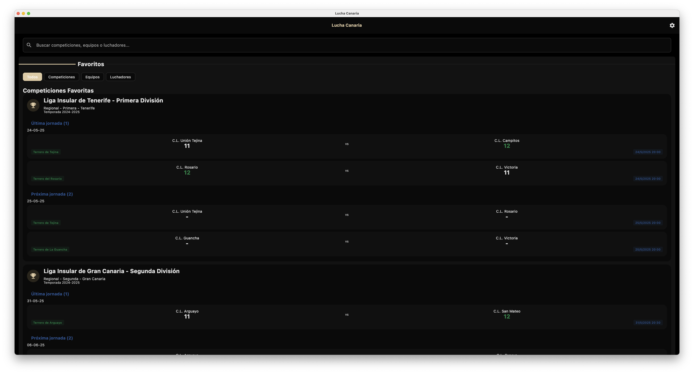
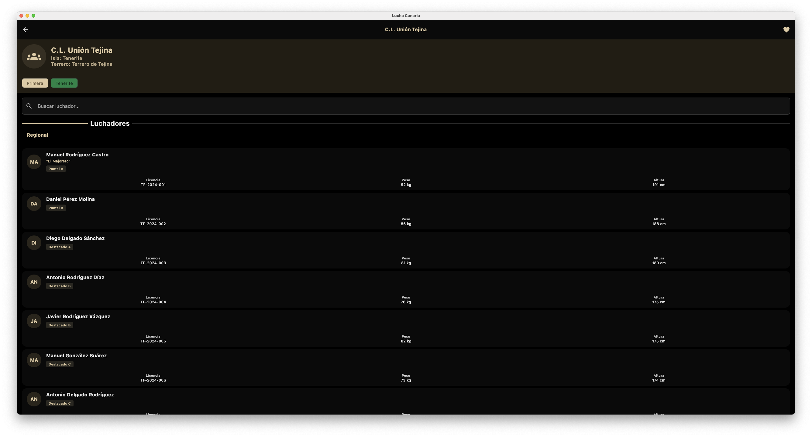
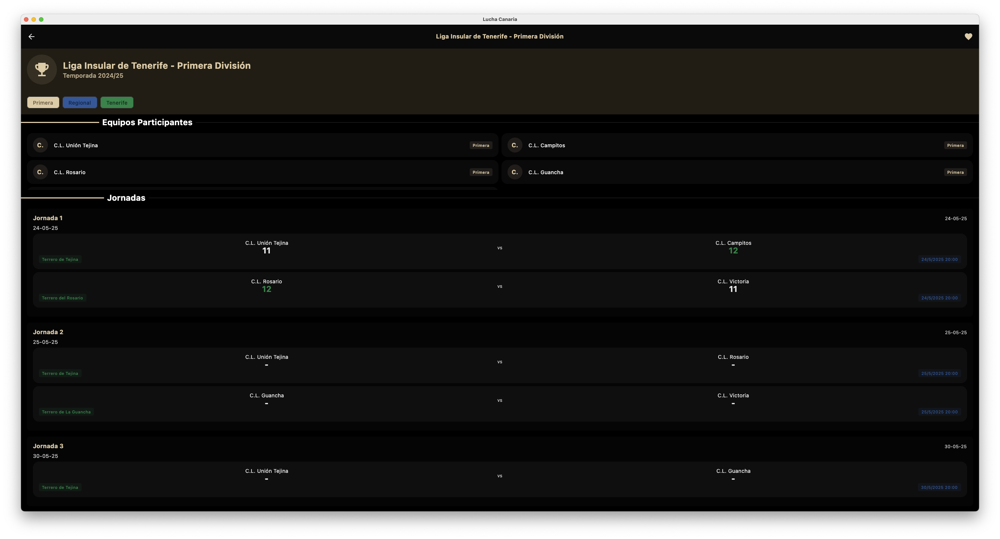
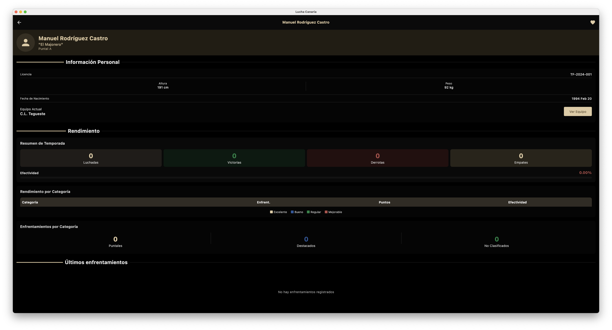
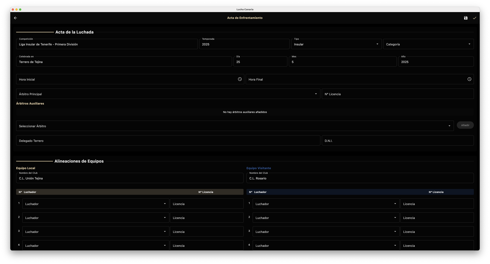

# LuchaApp

**Proyecto de Fin de Curso - 2º DAM**  
**Instituto:** IES Haría  
**Autor:** José Antonio Navarro Pérez

## 📋 Descripción del Proyecto

LuchaApp es una aplicación multiplataforma integral para la gestión y seguimiento de competiciones de **Lucha Canaria**, el deporte tradicional de las Islas Canarias. El proyecto consta de una API REST robusta desarrollada en Kotlin con Ktor y una aplicación cliente multiplataforma construida con Kotlin Multiplatform y Compose Multiplatform.

### Características Principales

- **Gestión completa de competiciones**: Organización de ligas y torneos con múltiples categorías por edad y división
- **Seguimiento de luchadores**: Perfiles detallados, estadísticas y historial de enfrentamientos
- **Gestión de equipos**: Información de clubes, plantillas y resultados
- **Actas de partido**: Sistema completo para registrar detalles de cada enfrentamiento
- **Sistema de favoritos**: Permite a los usuarios seguir sus luchadores, equipos y competiciones preferidas
- **Autenticación y roles**: Sistema de usuarios con diferentes permisos (admin, gestor, espectador)
- **Búsqueda avanzada**: Búsqueda global en tiempo real de luchadores, equipos y competiciones

## 🛠️ Tecnologías Utilizadas

### Backend - API Server

- **Lenguaje**: Kotlin
- **Framework**: Ktor 2.3.12
- **Base de datos**: MongoDB 8.0
- **Autenticación**: JWT (JSON Web Tokens)
- **Seguridad**: BCrypt para hash de contraseñas
- **Inyección de dependencias**: Koin 3.5.3
- **Servidor**: Netty
- **Serialización**: Kotlinx Serialization

### Frontend - App Multiplataforma

- **Framework**: Kotlin Multiplatform (KMP) 2.1.20
- **UI**: Compose Multiplatform 1.7.3
- **Plataformas soportadas**: 
  - ✅ Desktop (JVM) - Completamente funcional
  - 🚧 Android - En desarrollo
  - 🚧 iOS - En desarrollo
- **Navegación**: Voyager
- **Cliente HTTP**: Ktor Client 3.1.1
- **Inyección de dependencias**: Koin 4.0.2
- **Gestión de estado**: ViewModels con StateFlow

## 📁 Estructura del Proyecto

```
LuchaApp/
│
├── api-server/                    # Backend API REST
│   ├── src/main/kotlin/org/iesharia/
│   │   ├── config/               # Configuración del servidor
│   │   │   ├── Authentication.kt # Configuración JWT
│   │   │   ├── CORS.kt          # Políticas CORS
│   │   │   ├── DatabaseConfig.kt # Conexión MongoDB
│   │   │   └── ...
│   │   │
│   │   ├── data/                # Capa de datos
│   │   │   ├── models/          # Modelos de MongoDB
│   │   │   │   ├── UserDocument.kt
│   │   │   │   ├── WrestlerDocument.kt
│   │   │   │   ├── TeamDocument.kt
│   │   │   │   ├── MatchDocument.kt
│   │   │   │   └── ...
│   │   │   └── repositories/    # Implementación de repositorios
│   │   │
│   │   ├── domain/              # Lógica de negocio
│   │   │   ├── models/          
│   │   │   │   ├── dto/         # Data Transfer Objects
│   │   │   │   └── SharedEnums.kt
│   │   │   └── services/        # Servicios de dominio
│   │   │
│   │   └── presentation/        # Capa de presentación
│   │       └── routes/          # Endpoints de la API
│   │
│   ├── scripts/                 # Scripts de utilidad
│   │   ├── seed-data.js        # Datos de prueba
│   │   ├── deploy.sh           # Despliegue
│   │   └── ...
│   │
│   └── docs/                    # Documentación del servidor
│
├── app-multiplatform/           # Cliente multiplataforma
│   ├── composeApp/             # Aplicación Compose
│   │   └── src/
│   │       ├── commonMain/     # Código compartido
│   │       │   └── kotlin/org/iesharia/
│   │       │       ├── app/    # Punto de entrada
│   │       │       ├── core/   # Componentes base
│   │       │       │   ├── navigation/
│   │       │       │   ├── ui/
│   │       │       │   │   ├── components/
│   │       │       │   │   └── theme/
│   │       │       │   └── ...
│   │       │       ├── di/     # Inyección de dependencias
│   │       │       └── features/ # Módulos por funcionalidad
│   │       │           ├── auth/
│   │       │           ├── competitions/
│   │       │           ├── wrestlers/
│   │       │           ├── teams/
│   │       │           ├── matches/
│   │       │           └── home/
│   │       │
│   │       ├── androidMain/    # Código específico Android
│   │       ├── iosMain/        # Código específico iOS
│   │       └── desktopMain/    # Código específico Desktop
│   │
│   └── shared/                 # Lógica compartida
│       └── src/commonMain/
│           └── kotlin/org/iesharia/
│               ├── core/       # Núcleo compartido
│               │   ├── network/ # Cliente HTTP
│               │   ├── auth/    # Gestión de sesión
│               │   └── domain/  # Modelos de dominio
│               └── features/   # Casos de uso
│
└── docs/                       # Documentación del proyecto
    ├── anteproyecto/          # Documentación inicial
    └── screenshots/           # Capturas de pantalla

```

## 🖼️ Capturas de Pantalla (Desktop)

### Pantalla de Login


### Pantalla Principal (Home)


### Detalle de Equipos


### Detalle de Competiciones


### Detalle de Luchadores


### Creación de Acta


## 🚀 Instalación y Ejecución

### Requisitos Previos

- JDK 17 o superior
- MongoDB 5.0 o superior
- Gradle 8.0 o superior

### Backend - API Server

1. Navegar al directorio del servidor:
   ```bash
   cd api-server
   ```

2. Configurar las variables de entorno en `application.yaml`:
   ```yaml
   ktor:
     deployment:
       port: 8080
   
   database:
     mongodb:
       connectionString: "mongodb://localhost:27017"
       database: "luchacanaria"
   
   jwt:
     secret: "your-secret-key"
     issuer: "lucha-app"
     audience: "lucha-app-users"
     realm: "lucha-app"
   ```

3. Ejecutar el servidor:
   ```bash
   ./gradlew run
   ```

4. (Opcional) Cargar datos de prueba:
   ```bash
   cd scripts
   mongosh < seed-data.js
   ```

### Frontend - Aplicación Desktop

1. Navegar al directorio de la aplicación:
   ```bash
   cd app-multiplatform
   ```

2. Ejecutar la aplicación desktop:
   ```bash
   ./gradlew :composeApp:run
   ```

## 📚 Arquitectura

El proyecto sigue los principios de **Clean Architecture** con una clara separación de responsabilidades:

### Backend
- **Capa de Presentación**: Rutas Ktor que exponen los endpoints REST
- **Capa de Dominio**: Servicios que contienen la lógica de negocio
- **Capa de Datos**: Repositorios que gestionan la persistencia con MongoDB

### Frontend
- **Capa de Presentación**: Pantallas Compose y ViewModels
- **Capa de Dominio**: Casos de uso que encapsulan la lógica
- **Capa de Datos**: Repositorios que consumen la API REST

## 🔐 Seguridad

- Autenticación basada en JWT
- Contraseñas hasheadas con BCrypt
- Sistema de roles y permisos
- Validación de datos en servidor y cliente
- CORS configurado para producción

## 📝 Licencia

Este proyecto es un trabajo académico desarrollado como Proyecto de Fin de Curso para el Ciclo Formativo de Grado Superior en Desarrollo de Aplicaciones Multiplataforma (2º DAM) en el IES Haría.

---

**Desarrollado por:** José Antonio Navarro Pérez  
**Curso:** 2024-2025  
**Instituto:** IES Haría
