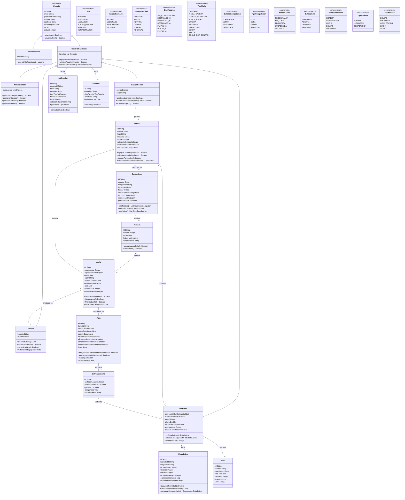

# Anteproyecto: LuchaApp

**Curso:** 2º DAM - IES Haría - 2024/2025  
**Autor:** José Antonio Navarro Pérez 

## Índice
1. [Tipo de proyecto](#tipo-de-proyecto)
2. [Descripción de la aplicación](#descripción-de-la-aplicación)
   - [La idea](#la-idea)
   - [Roles](#roles)
   - [Requisitos funcionales](#requisitos-funcionales)
3. [Diseño de la aplicación](#diseño-de-la-aplicación)
   - [Diagrama UML de clases](#diagrama-uml-de-clases)
4. [Tecnologías a utilizar](#tecnologías-a-utilizar)
   - [Base de datos](#base-de-datos)
   - [Desarrollo multiplataforma](#desarrollo-multiplataforma)
   - [Desarrollo de servicios](#desarrollo-de-servicios)
   - [Entornos de desarrollo](#entornos-de-desarrollo)
5. [Viabilidad técnica/económica](#viabilidad-técnicaeconómica)
   - [Inversiones iniciales](#inversiones-iniciales)
   - [Costes fijos y variables](#costes-fijos-y-variables)
   - [Ingresos previstos](#ingresos-previstos)
   - [Beneficio esperado](#beneficio-esperado)
   - [Análisis de riesgos](#análisis-de-riesgos)
   - [Financiación](#financiación)
6. [Planificación temporal](#planificación-temporal)

## Tipo de proyecto

**Aplicación multiplataforma**

## Descripción de la aplicación

### La idea

LuchaApp es una plataforma integral para la gestión e información de la Lucha Canaria, deporte tradicional de las Islas Canarias. Esta aplicación permitirá digitalizar y centralizar toda la información relacionada con este deporte autóctono, facilitando su gestión, difusión y seguimiento.

La plataforma servirá como punto único para el registro de competiciones, equipos, luchadores, resultados y estadísticas, ofreciendo funcionalidades específicas según el rol del usuario. Además, permitirá a aficionados mantenerse informados sobre eventos, resultados y sus luchadores o equipos favoritos mediante un sistema de notificaciones personalizado.

### Roles

#### 1. Administradores Corporativos/Federativos
- Gestión completa del sistema
- Creación y configuración de competiciones, torneos y eventos
- Asignación de árbitros a encuentros
- Gestión de equipos y luchadores oficiales
- Acceso a estadísticas globales e informes
- Verificación y validación de resultados
- Gestión de roles y permisos

#### 2. Árbitros
- Apertura de actas digitales para luchas asignadas
- Registro en tiempo real de resultados y acciones durante los encuentros
- Validación y cierre de actas tras finalizar los encuentros
- Consulta de histórico de actas anteriores
- Acceso a reglamento y herramientas de apoyo para arbitraje

#### 3. Equipos (Mandadores/Directivos)
- Actualización de datos del equipo
- Gestión del plantel de luchadores
- Selección de convocados para cada encuentro
- Visualización de estadísticas del equipo y luchadores
- Acceso a calendario de competición personalizado
- Comunicación con la organización

#### 4. Luchadores
- Visualización de perfil personal con estadísticas detalladas
- Seguimiento de su categoría actual y evolución
- Registro histórico de luchas y resultados
- Estadísticas de tipos de tumbadas realizadas y recibidas
- Clasificación personal en el ranking general
- Notificaciones sobre convocatorias y próximos encuentros

#### 5. Usuarios registrados
- Consulta de información completa sobre competiciones
- Seguimiento de resultados en tiempo real
- Configuración de equipos y luchadores favoritos
- Sistema de notificaciones para eventos relacionados con favoritos
- Acceso a estadísticas históricas y comparativas

#### 6. Usuarios invitados
- Visualización básica de competiciones y resultados
- Acceso a información general sobre equipos y luchadores
- Consulta de calendario de eventos
- Sin acceso a funcionalidades de favoritos o notificaciones

### Requisitos funcionales

#### 1. Sistema de autenticación y gestión de roles
- Registro de usuarios con diferentes niveles de acceso
- Autenticación segura mediante email/contraseña o redes sociales
- Verificación especial para roles privilegiados (administradores, árbitros, equipos)

#### 2. Gestión de competiciones
- Creación de torneos con múltiples jornadas y encuentros
- Configuración de sistemas de puntuación y clasificación
- Seguimiento en tiempo real del estado de las competiciones
- Histórico de competiciones pasadas

#### 3. Sistema de actas digitales
- Creación de actas para cada encuentro
- Registro de alineaciones, resultados y acciones destacadas
- Validación y firma digital de actas por árbitros
- Exportación de actas en formato PDF para documentación oficial

#### 4. Gestión de equipos y luchadores
- Fichas completas con información y estadísticas
- Categorización de luchadores según peso y nivel
- Seguimiento de histórico de pertenencia a equipos
- Registro de lesiones y periodos de inactividad

#### 5. Sistema de estadísticas avanzadas
- Análisis de rendimiento individual y por equipos
- Clasificación de técnicas y mañas utilizadas
- Generación de informes personalizados
- Visualización gráfica de evolución y tendencias

#### 6. Módulo de notificaciones
- Alertas para próximos encuentros
- Notificaciones en tiempo real de resultados
- Avisos personalizados según preferencias del usuario
- Recordatorios para eventos importantes

#### 7. Interfaz de usuario adaptativa
- Diseño responsivo para diferentes dispositivos
- Interfaces específicas según rol del usuario
- Modo oscuro y ajustes de accesibilidad
- Soporte multiidioma (español, inglés)

#### 8. Modo offline
- Acceso a información básica sin conexión a internet
- Sincronización automática al recuperar conexión
- Almacenamiento local de datos frecuentes

## Diseño de la aplicación

### Diagrama UML de clases

La estructura del modelo UML de LuchaApp refleja un diseño orientado a objetos completo para gestionar todos los aspectos de la Lucha Canaria:

- **Jerarquía de usuarios**: Un diseño flexible con una clase abstracta Usuario y especializaciones para diferentes roles (Administrador, Árbitro, Luchador, etc.)
   
- **Gestión de competiciones**: Modelado de la estructura jerárquica Competición > Jornada > Lucha > Enfrentamiento
   
- **Entidades deportivas**: Representación completa de Equipos, Luchadores y sus características específicas
   
- **Sistema de actas**: Estructura para la digitalización completa del proceso de arbitraje
   
- **Estadísticas y análisis**: Clases para el almacenamiento y procesamiento de datos estadísticos
   
- **Notificaciones y favoritos**: Implementación del sistema de seguimiento personalizado

## Tecnologías a utilizar

### Base de datos

#### MongoDB
- **Justificación:** MongoDB es una base de datos NoSQL orientada a documentos que ofrece gran flexibilidad para modelar datos complejos y jerárquicos como los que maneja la aplicación (competiciones, equipos, luchadores, estadísticas). Su modelo de documentos JSON/BSON permite representar de forma natural las relaciones entre entidades deportivas.
- **Características clave:**
  - Escalabilidad horizontal para manejar crecientes volúmenes de datos
  - Esquemas flexibles que permiten agregar nuevos campos sin interrupciones
  - Alto rendimiento en operaciones de lectura y escritura
  - Indexación eficiente para consultas complejas de estadísticas
  - Capacidades de geolocalización para ubicar eventos de lucha
  - Replicación para alta disponibilidad

### Desarrollo multiplataforma

#### Kotlin Multiplatform (KMP) 2.0
- **Justificación:** KMP 2.0 permite compartir código entre diferentes plataformas, manteniendo la coherencia en la lógica de negocio mientras se utilizan interfaces nativas para cada plataforma. Esto asegura una experiencia de usuario óptima junto con eficiencia en el desarrollo.
- **Componentes:**
  - Compose Multiplatform: Para interfaces de usuario compartidas entre Android, iOS y desktop
  - Kotlin/Native: Para compilación nativa en iOS
  - Kotlin/JVM: Para Android y backend
  - SQLDelight: Para persistencia local multiplataforma
  - Ktor Client: Para comunicaciones de red coherentes entre plataformas

**Frameworks específicos por plataforma:**
- Android: Jetpack Compose para UI modernas y reactivas
- iOS: SwiftUI con wrapper de Kotlin/Native
- Web: Kotlin/JS con React para versión web

### Desarrollo de servicios

#### Backend con Kotlin
- **Justificación:** Utilizar Kotlin tanto en backend como en frontend permite compartir modelos de datos, evitando duplicidades y posibles inconsistencias. Kotlin proporciona seguridad de tipos, null-safety y expresividad para desarrollar APIs robustas.
- **Tecnologías:**
  - Ktor Server: Framework ligero y flexible para desarrollo de APIs RESTful
  - Kotlin Serialization: Para serialización/deserialización eficiente de datos
  - Kotlin Coroutines: Para manejo asíncrono y concurrente de peticiones
  - Koin: Para inyección de dependencias
  - Kotlin Logging: Para logs estructurados
  - MongoDB Kotlin Driver: Para interacción nativa con MongoDB

#### Sistema de Autenticación Propio
- JWT (JSON Web Tokens): Para gestión segura de sesiones
- Argon2: Para hash seguro de contraseñas
- Refresh tokens: Para renovación segura de sesiones
- Rate limiting: Para prevención de ataques de fuerza bruta

#### Sistema de Notificaciones Propio
- WebSockets: Para actualizaciones en tiempo real y notificaciones en la aplicación
- Servicio de notificaciones push propio: Implementado con Kotlin para Android e iOS
- APNs (Apple Push Notification service): Integración directa para iOS
- Capa de abstracción de notificaciones: Para gestionar diferentes canales (push, email, in-app)

### Entornos de desarrollo

#### Herramientas de desarrollo
- IntelliJ IDEA: Como IDE principal para desarrollo Kotlin (backend y KMP)
- Android Studio: Para desarrollo y pruebas específicas de Android
- Xcode: Para configuración y pruebas específicas de iOS
- Figma: Para diseño y prototipado de interfaces
- MongoDB Compass: Para gestión y visualización de datos
- Docker: Para containerización de servicios y entornos de desarrollo consistentes
- Kubernetes: Para orquestación de contenedores en producción

#### Infraestructura y DevOps
- GitHub: Para control de versiones y colaboración
- GitHub Actions: Para integración continua y despliegue automático
- JUnit y Kotest: Para pruebas unitarias
- Detekt: Para análisis estático de código Kotlin
- Ktor Testing: Para pruebas de integración de API
- MongoDB Atlas o instalación on-premise: Flexibilidad para elegir despliegue en la nube o local

#### Seguridad
- HTTPS/TLS: Para comunicaciones seguras
- OWASP Security Headers: Para protección contra vulnerabilidades web comunes
- Auditoría de seguridad: Logging de acciones sensibles y monitorización
- Cifrado de datos sensibles: A nivel de aplicación y base de datos

## Planificación temporal

| Fase | Descripción | Duración | Fechas |
|------|-------------|----------|--------|
| 1 | Análisis y diseño | 1 semanas | XX/XX - XX/XX |
| 2 | Desarrollo de backend | 1 semanas | XX/XX - XX/XX |
| 3 | Desarrollo frontend multiplataforma | 2 semanas | XX/XX - XX/XX |
| 4 | Integración y pruebas | 3 días | XX/XX - XX/XX |
| 5 | Despliegue y lanzamiento | 3 días | XX/XX - XX/XX |